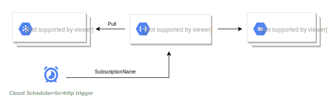

# Pubsub backup

This repository contains functions to backup and compress pubsub messages in a storage bucket. In an event-driven architecture, it may be useful to store the event history that passes a topic to a storage bucket. This facilitates the replaying of the entire event history to, for example, another topic.

Note: topics, push subscriptions, scheduler and buckets not included!

Literature: [Pub/sub push subscriptions](https://cloud.google.com/pubsub/docs/push)
