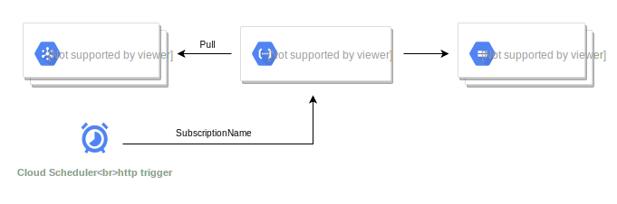

# Pubsub backup function

This repository contains a function to backup and compress (gzip) pubsub messages in a storage bucket. In an event-driven architecture, it may be useful to store the event history that passes a topic to a storage bucket. This facilitates the replaying of the entire event history.

There are several helper scripts included:

- deploy.sh: deploy the backup function to Google.
- schedule.sh: create a backup scheduler which will post a request to the backup function.
- post.sh: test the backup function with a http POST request with Bearer token.

Note: backup bucket not included!

Literature: [Pub/sub push subscriptions](https://cloud.google.com/pubsub/docs/push)

## License
[GPL-3](https://www.gnu.org/licenses/gpl-3.0.en.html)
